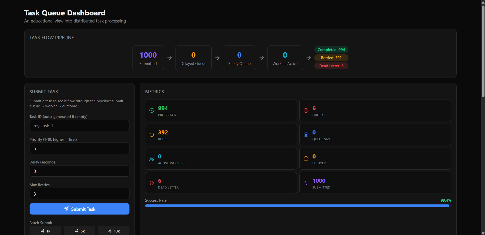
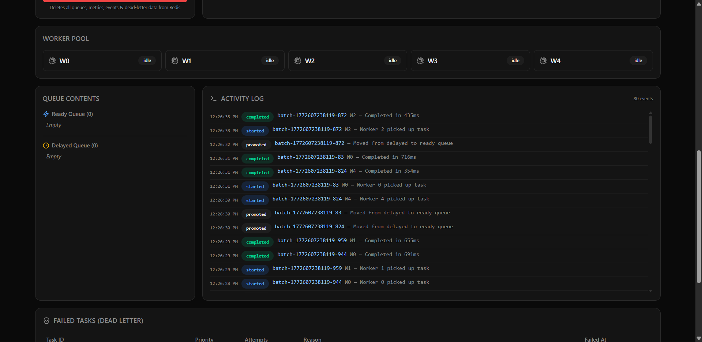
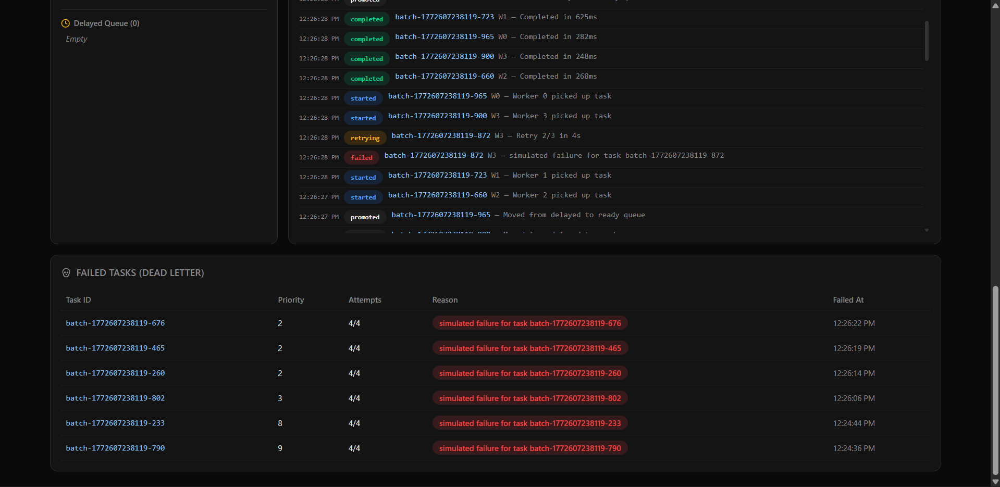

# Task Queue — An Educational Distributed Task Processing System

A visual, hands-on platform for learning how distributed task queues work. Submit tasks, watch them flow through priority queues, get picked up by workers, retry on failure, and land in dead-letter storage — all in real time.

Built with **Go**, **Next.js**, **Redis**, and **Docker**.

## Why This Exists

Most task queue tutorials explain concepts in text. This project lets you **see** the internals:

- Watch tasks move from submission → delayed queue → ready queue → worker → outcome
- See workers pulse blue when processing, with task IDs and elapsed timers
- Observe retry logic with exponential backoff in real time
- Track success rates, queue depths, and dead-letter growth on a live dashboard

Perfect for anyone learning about:
- Concurrent worker pools (Go goroutines)
- Priority queues with Redis sorted sets
- Retry strategies and exponential backoff
- Dead-letter patterns
- Real-time dashboards with polling

## Screenshots

**Task Flow Pipeline, Submit Form & Metrics** — see tasks flow through the system with real-time counters and a 99.4% success rate bar.



**Worker Pool, Queue Contents & Activity Log** — monitor 5 workers, peek into queues, and watch a live event stream with color-coded badges (completed, started, promoted, failed, retrying).



**Activity Log & Dead-Letter Table** — trace the full lifecycle of failed tasks from failure → retry → dead-letter, with attempt counts and timestamps.



## Architecture

```
┌──────────────────┐     ┌──────────────────────┐     ┌───────────┐
│   Next.js 15     │────▶│   Go 1.22 Backend    │────▶│  Redis 7  │
│   Dashboard      │     │   HTTP API + Workers  │     │           │
│   :3000          │     │   :8080               │     │   :6379   │
└──────────────────┘     └──────────────────────┘     └───────────┘
```

### Task Lifecycle

```
Submit ──▶ delay > 0? ──Yes──▶ Delayed Queue (ZSET, score = timestamp)
               │                        │
               No                  scheduler polls 1s
               │                        │
               ▼                        ▼
         Ready Queue (ZSET, score = -priority)
               │
               ▼
         Worker Pool (N goroutines, poll via ZPOPMIN)
               │
               ▼
         Execute (200-800ms simulated work, ~30% failure)
               │
          ┌────┴────┐
          ▼         ▼
       Success    Failure
          │         │
          │    retries left? ──Yes──▶ Delayed Queue (backoff: 2^n sec)
          │         │
          │         No
          │         │
          ▼         ▼
       Metrics   Dead-Letter Queue
```

## Dashboard

The dashboard is a multi-panel educational view with six sections:

| Section | Description | Poll Rate |
|---------|-------------|-----------|
| **Task Flow Pipeline** | Visual pipeline showing task counts at each stage | 3s |
| **Submit Form** | Single task + batch submit (1k/5k/10k) with configurable params | — |
| **Metrics** | 8 stat cards + success rate progress bar | 3s |
| **Worker Pool** | Per-worker cards showing status, current task, elapsed time | 1s |
| **Queue Contents** | Peek into ready + delayed queues with countdown timers | 2s |
| **Activity Log** | Terminal-style live event stream (submitted, started, completed, failed, retrying, dead_lettered, promoted) | 1s |
| **Failed Tasks** | Dead-letter table with task details and failure reasons | 5s |

Additional features:
- **Batch submit** with customizable priority range, delay chance, max retries
- **Clear All Data** button to reset Redis and start fresh (with confirmation dialog)

## Quick Start

### Prerequisites

- [Docker](https://docs.docker.com/get-docker/) and [Docker Compose](https://docs.docker.com/compose/install/)

That's it — Go and Node.js run inside containers.

### Run

```bash
git clone https://github.com/kripa-sindhu-007/weekend_project_1.git
cd weekend_project_1
docker compose up --build
```

Open [http://localhost:3000](http://localhost:3000) to see the dashboard.

### Try It Out

1. Click **"5k"** to open the batch config dialog — adjust settings and send 5,000 tasks
2. Watch the **Task Flow Pipeline** counters increment in real time
3. See **Worker Pool** cards pulse blue as workers pick up tasks
4. Watch the **Activity Log** stream events: submitted → started → completed/failed → retrying → dead_lettered
5. Check **Queue Contents** to see tasks draining from the ready queue
6. Observe **Metrics** — success rate, retry count, dead-letter growth
7. When done, click **"Clear All Data"** to reset everything

### Stop

```bash
docker compose down       # stop containers
docker compose down -v    # stop + remove Redis data volume
```

## API Endpoints

| Method | Path | Description |
|--------|------|-------------|
| `POST` | `/api/tasks` | Submit a task |
| `GET` | `/api/metrics` | Basic metrics (processed, failed, retries, queue size, active workers) |
| `GET` | `/api/metrics/enhanced` | Extended metrics (+ success rate, delayed size, DLQ size, submitted count) |
| `GET` | `/api/events?limit=50` | Recent activity log events |
| `GET` | `/api/workers` | Current worker states |
| `GET` | `/api/queues` | Peek at ready + delayed queue contents |
| `GET` | `/api/tasks/failed?offset=0&limit=20` | Dead-lettered tasks |
| `DELETE` | `/api/flush` | Clear all Redis data |
| `GET` | `/api/health` | Health check (pings Redis) |

### Example: Submit a Task

```bash
curl -X POST http://localhost:8080/api/tasks \
  -H "Content-Type: application/json" \
  -d '{"id": "my-task-1", "priority": 8, "delay": 5, "max_retries": 3}'
```

| Field | Type | Description |
|-------|------|-------------|
| `id` | string | Unique task identifier (required) |
| `priority` | int | 1–10, higher priority processes first |
| `delay` | int | Seconds to wait before task becomes eligible |
| `max_retries` | int | Retry attempts before dead-lettering |

## Configuration

Environment variables (set in `docker-compose.yml`):

| Variable | Default | Description |
|----------|---------|-------------|
| `REDIS_ADDR` | `localhost:6379` | Redis connection address |
| `REDIS_PASSWORD` | _(empty)_ | Redis password |
| `SERVER_PORT` | `8080` | HTTP API port |
| `WORKER_COUNT` | `5` | Number of worker goroutines |
| `POLL_INTERVAL_MS` | `500` | Worker queue poll interval (ms) |

## Project Structure

```
├── backend/
│   ├── cmd/server/main.go          # Entry point, wiring, graceful shutdown
│   └── internal/
│       ├── config/config.go        # Environment-based configuration
│       ├── model/task.go           # All data structs
│       ├── store/
│       │   ├── redis.go            # Redis client + key constants
│       │   ├── metrics.go          # Metrics counters (HINCRBY)
│       │   ├── deadletter.go       # Dead-letter list (LPUSH/LRANGE)
│       │   ├── events.go           # Event log (LPUSH + LTRIM 200)
│       │   ├── workerstate.go      # Worker states (HSET/HGETALL)
│       │   └── queuepeek.go        # Queue peek (ZRANGE)
│       ├── queue/
│       │   ├── queue.go            # Priority queue (ZADD/ZPOPMIN)
│       │   └── delayed.go          # Delayed scheduler (1s tick)
│       ├── worker/
│       │   ├── executor.go         # Task execution + event emission
│       │   └── pool.go             # Goroutine pool management
│       └── api/
│           ├── handler.go          # HTTP handlers
│           ├── router.go           # Route registration
│           └── middleware.go       # CORS, logging, recovery
├── frontend/
│   ├── app/
│   │   ├── page.tsx                # Dashboard layout
│   │   ├── layout.tsx              # Root layout
│   │   └── globals.css             # Tailwind + dark theme
│   ├── components/
│   │   ├── TaskFlowDiagram.tsx     # Pipeline visualization
│   │   ├── TaskSubmissionPanel.tsx  # Submit form + batch + flush
│   │   ├── MetricsPanel.tsx        # 8 stat cards + success rate bar
│   │   ├── WorkerPoolPanel.tsx     # Worker status cards
│   │   ├── QueuePanel.tsx          # Queue contents viewer
│   │   ├── ActivityLog.tsx         # Live event stream
│   │   ├── FailedTasksPanel.tsx    # Dead-letter table
│   │   └── ui/                     # Reusable UI components (shadcn-style)
│   └── lib/
│       ├── api.ts                  # API client functions
│       ├── types.ts                # TypeScript interfaces
│       ├── hooks.ts                # usePolling hook
│       └── utils.ts                # cn() helper
└── docker-compose.yml
```

## Tech Stack

| Layer | Technology | Why |
|-------|-----------|-----|
| **Backend** | Go 1.22 (stdlib only + go-redis) | Goroutines are natural for worker pools, stdlib mux for zero-dep routing |
| **Queue** | Redis 7 sorted sets | ZADD/ZPOPMIN gives O(log N) priority queue with atomic dequeue |
| **Frontend** | Next.js 15 + React 19 | App router, standalone Docker output |
| **Styling** | Tailwind CSS + shadcn/ui pattern | Dark theme, consistent component library |
| **Animation** | Framer Motion | Smooth transitions for worker states, event entries, queue changes |
| **Icons** | Lucide React | Clean, consistent icon set |

## Contributing

Contributions are welcome! Feel free to open issues or submit pull requests.

## License

MIT License — see [LICENSE](LICENSE) for details.
